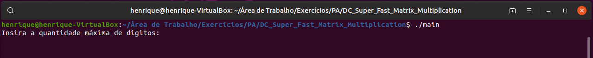
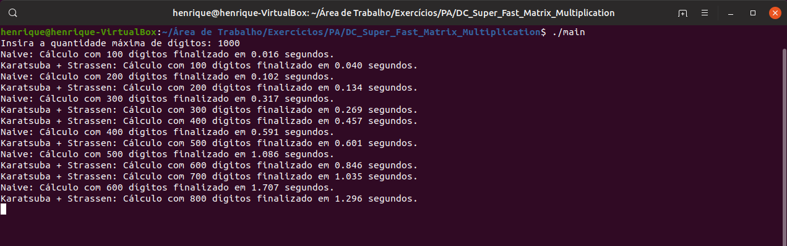
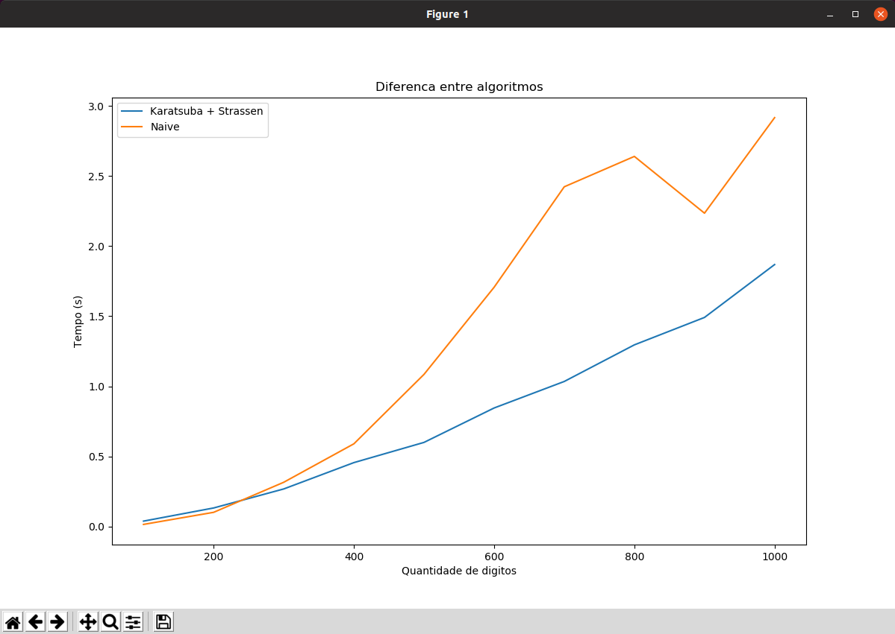

# Super Fast Matrix Multiplication

**Número da Lista**: 4<br>
**Conteúdo da Disciplina**: Dividir e Conquistar<br>

## Alunos
|Matrícula | Aluno |
| -- | -- |
| 17/0050394  |  Henrique Martins de Messias |

## Sobre 
O software deste repositório usa <b>Karatsuba + Strassen</b> para calcular multiplicação de matrizes.

## Screenshots






## Instalação 
**Linguagem**: C++<br>
É necessário ter o matplotlib instalado, para fazer isso, utilize o seguinte comando:

```bash
    $ sudo apt-get install python-matplotlib python-numpy python2.7-dev
```

Quaisquer dúvidas sobre essa instalação, clique [aqui](https://github.com/lava/matplotlib-cpp).

## Uso

No terminal, vá até o diretório do exercício, que contém, além de arquivos como o README, o arquivo "main.cpp".

Para compilar o código, digite:

  ```bash
    $ make
  ```

Para executar o código, digite:

  ```bash
    $ ./main
  ```

## Outros

É feito uma comparação entre duas maneiras de se calcular multiplicação de matriz:

- Usando métodos de multiplicação e multiplicação de matrizes padrão (Naive).
- Usando método Karatsuba de multiplicação e Strassen de multiplicação de matrizes (Karatsuba + Strassen).